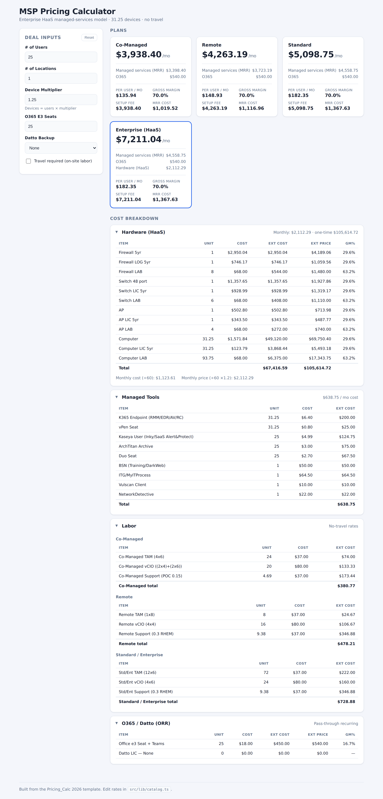

# MSP Pricing Calculator

An interactive pricing calculator for MSP managed-services deals, built from the
**Pricing_Calc 2026 — "Enterprise HaaS"** spreadsheet. Change the deal inputs and
every plan re-prices live.



## What it does

Given a handful of deal inputs, it computes the monthly price of four plans:

| Plan | Labor tier | Bundles hardware (HaaS)? |
| --- | --- | --- |
| **Co-Managed** | Co-Managed | No |
| **Remote** | Remote | No |
| **Standard** | Standard/Enterprise | No |
| **Enterprise (HaaS)** | Standard/Enterprise | Yes |

### The model

1. **Hardware (HaaS)** — firewalls, switches, APs and computers. Site gear scales
   with locations, computers scale with the device count, and each has an install
   ("LAB") line. Hardware is amortized over **60 months** to a monthly figure.
2. **Managed tools** — RMM/EDR, security and documentation tooling, per device or
   per user.
3. **Labor** — TAM / vCIO / Support hours per tier, with separate **travel** and
   **no-travel** rate sets (the travel toggle actually switches these — the source
   spreadsheet had the input but hard-wired the no-travel numbers).
4. **Pricing** — per-user cost `(tools + labor) / users` is marked up to a **70%
   target gross margin** (`price = cost / (1 − 0.70)`), multiplied by the user
   count for MRR.
5. **Recurring add-ons (ORR)** — O365 seats and Datto backup are added on top;
   Enterprise also adds the monthly HaaS hardware price.

`Total Monthly = O365 + MRR + Datto + (Enterprise only: HaaS)`

## Getting started

```bash
npm install
npm run dev        # start the dev server
npm run build      # type-check + production build
npm test           # run the engine parity tests
```

## Deploy to GitHub Pages

The app ships with a workflow ([`.github/workflows/deploy.yml`](.github/workflows/deploy.yml))
that builds and publishes to GitHub Pages on every push to the default branch.
Assets use relative paths, so it works from the project subpath
(`https://elevated-joe.github.io/pricing_cal/`).

**One-time setup** (in the repo on GitHub):

1. Go to **Settings → Pages**.
2. Under **Build and deployment → Source**, choose **GitHub Actions**.

That's it. The next push (or a manual **Actions → Deploy to GitHub Pages → Run
workflow**) builds and deploys. The live URL appears in the workflow run's
`deploy` step and under Settings → Pages.

> No server is involved — it's a fully static bundle, so it runs entirely from
> GitHub Pages.

## Project layout

```
src/
  lib/
    catalog.ts      # ← all rates, costs and multipliers live here (edit this)
    pricing.ts      # pure pricing engine (no UI); reads the catalog
    pricing.test.ts # locks the engine to the source spreadsheet's numbers
    format.ts       # currency / percent helpers
  components/        # InputsPanel, PlanCards, LineItemTable
  App.tsx            # wires inputs → engine → views
```

### Editing prices

Everything commercial is data in [`src/lib/catalog.ts`](src/lib/catalog.ts) —
hardware costs, tool costs, labor hours/rates, markup multipliers, the target
gross margin, and the Datto/O365 options. Change a number there and the whole
app (and the tests) update. `pricing.ts` contains no hard-coded prices.

## Tests

`npm test` verifies the engine reproduces the original spreadsheet cell-for-cell
(hardware totals, the 60-month monthly figures, tool and labor subtotals, and the
four plan `Total Monthly` values), plus interactive behaviour like the travel
toggle and O365/Datto add-ons.

## Tech

React + TypeScript + Vite, Vitest for tests. No backend — it's a static app.
